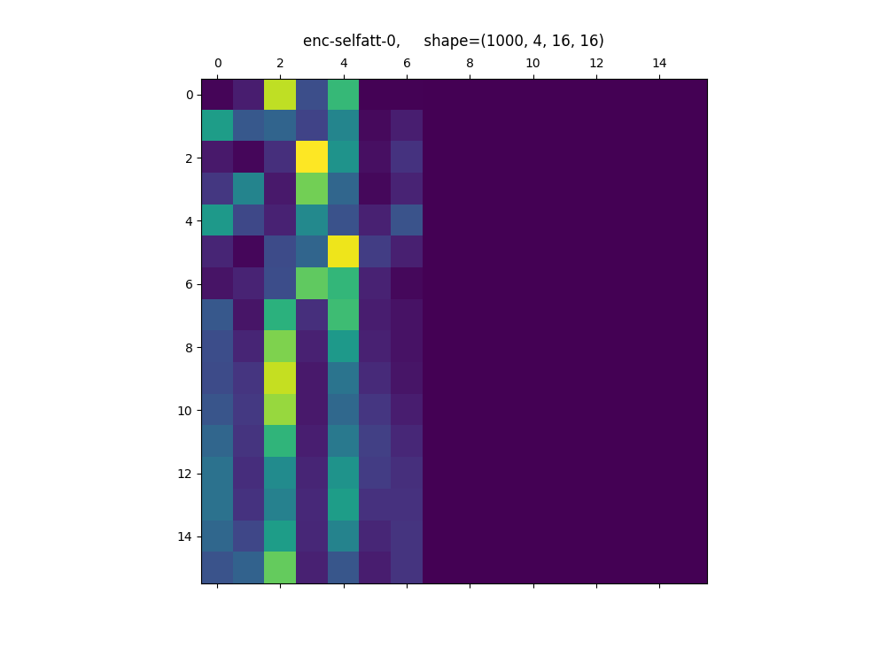
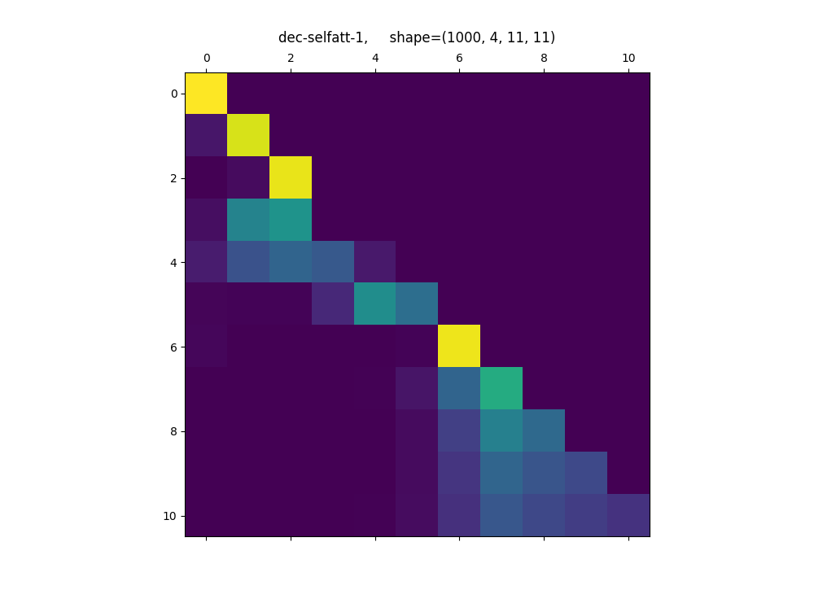
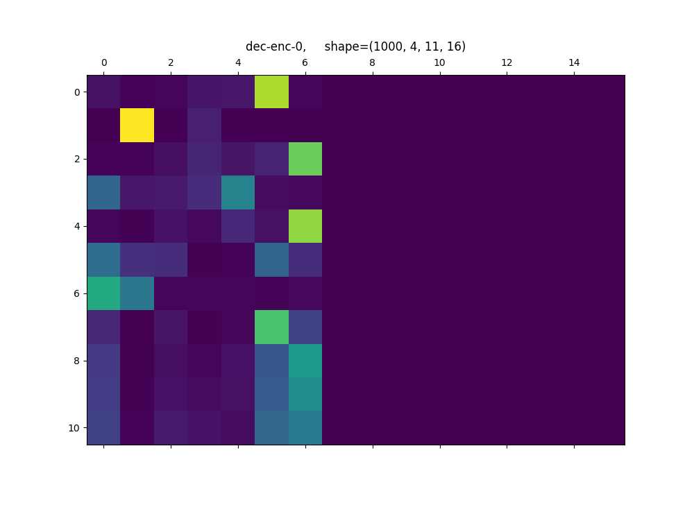
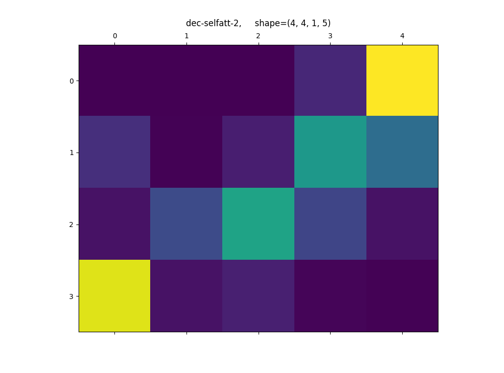
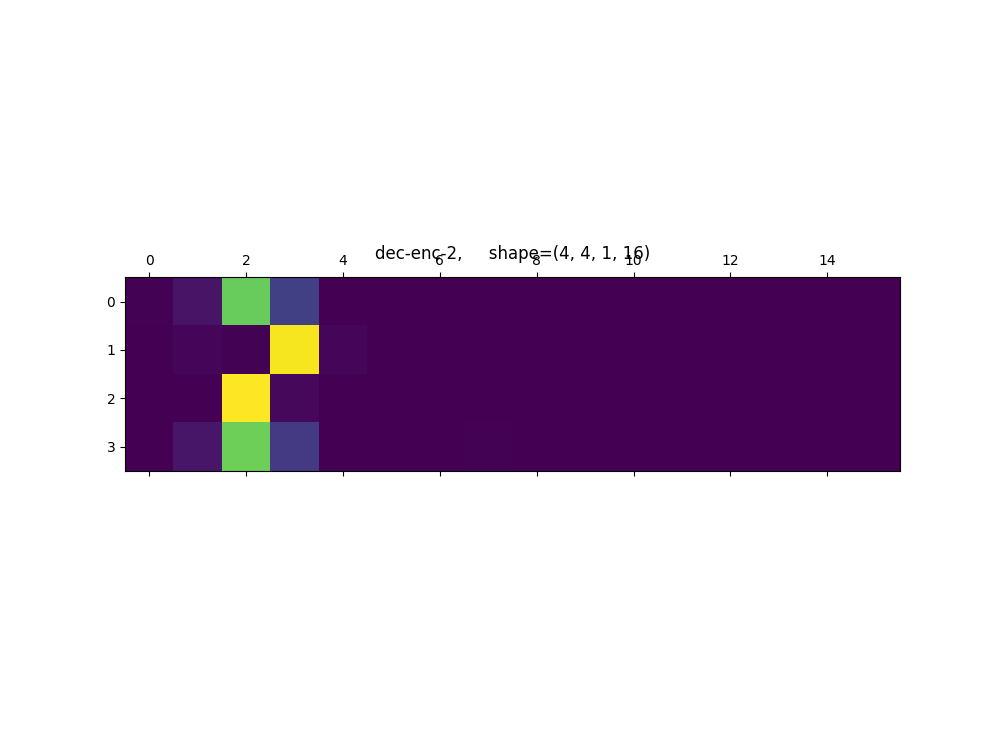

# Transformer Translation Model

## Basic

This implementation of the Transformer model as described in the [Attention is All You Need](https://arxiv.org/abs/1706.03762) paper. Based on the code provided by the Tensorflow offical [code](https://github.com/tensorflow/tensor2tensor/blob/master/tensor2tensor/models/transformer.py).

We don't cover **Beam Search** in our implementation. Our code is only a tool 
for learning Transformer model, not for achieve the state-of-the-art performance.

This implementation based on tensorflow 1.13 with eager execution. 

## Model

In `model` folder, we implement **transformer** model based on `attention_layer, encoder_layer, decoder_layer, embedding_layer, ffn_layer, layer_norm`. Each of the based model is inherited from `tf.keras.layers.Layer`. The final transformer model is inherited from `tf.keras.Model`.

## Data

Our code is only a tool for learning Transformer model. We use the small spanish-to-english translation dataset from `http://www.manythings.org/anki/`. We put it in `data` folder.

## Params

The training params is saved in `model/model_params.py`.

## Train

Run `python train.py` launches training process for 50 epochs. The weights will saved in `weights/` after each epochs.

## Eval

Run `python eval.py` to load pretrained model in `"weights/model_weight49.h5"` to evaluate in evaluation data.  The eval loss is about `0.4`.

## Translate

Run `python translate.py`.

source 1: <start> es un gran honor conocerte aqui . <end>
output 1: <start> it s a great great here . <end> 

source 2: <start> me gustaria hablar contigo sobre lo que ocurrio ayer en la escuela . <end>
output 2: <start> i d like to talk to you . <end>

source 3: <start> tom tiene una hermana que puede hablar frances . <end>
target 4: <start> tom has a sister . <end>

source 4: <start> soy un estudiante de la universidad . <end>
target 4: <start> i m a student . <end>

## Attention weights

### In evalutation

  
<b>encoder self-attention weights in evaluation.(The padding area has no weights)</b>  

  
<b>decoder self-attention weights in evaluation.(The words don not replay on later words)</b>  

  
<b>decoder encoder attention weights in evaluation(The padding area has no weights)</b>  

### In translation

  
<b>decoder self-attention weights when translate 5th word</b>  

  
<b>decoder-encoder attention weights when translate 5th word</b>  

